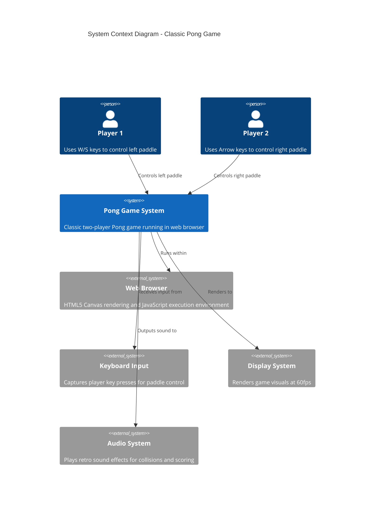
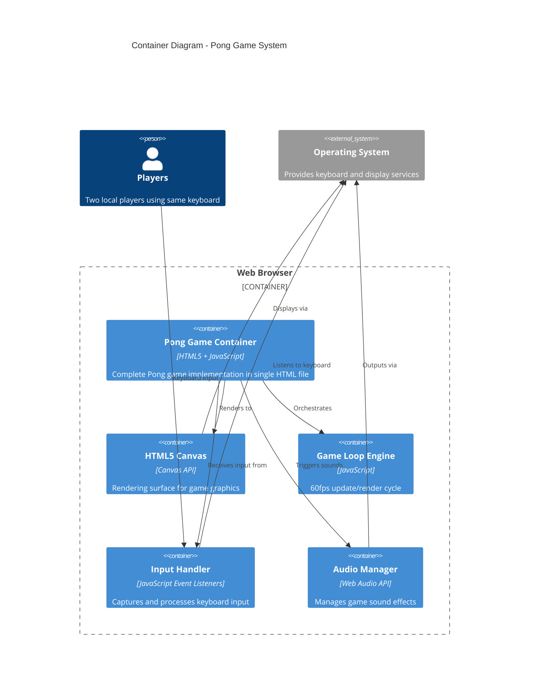
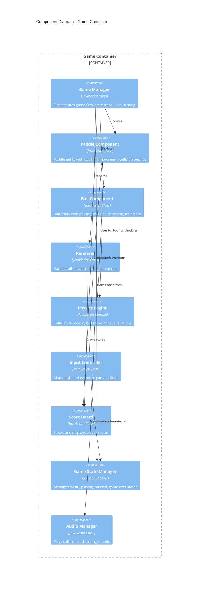
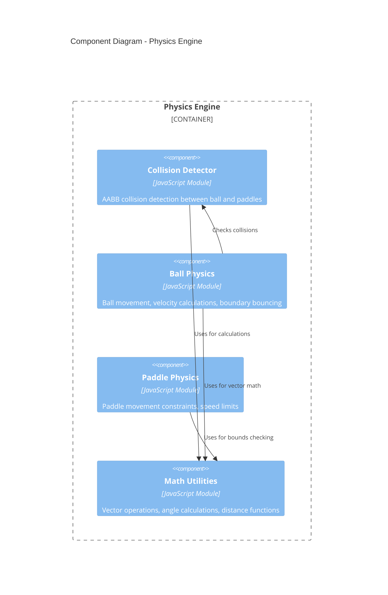

# Classic Atari Pong - C4 Architectural Design

## 1. Requirements Analysis

### Game Concept
Classic Atari Pong recreation featuring:
- **Core Gameplay**: Two paddles, one ball, simple physics
- **Scoring System**: First to reach target score wins
- **Local Multiplayer**: Two players on same keyboard
- **Visual Style**: Minimalist, retro Atari aesthetic
- **Performance**: Smooth 60fps gameplay
- **Platform**: Web browser (HTML5 Canvas + JavaScript)

### Key Requirements
- **Functional**: Paddle movement, ball physics, collision detection, scoring, game state management
- **Non-Functional**: 60fps performance, responsive controls, retro aesthetics, maintainable code
- **Constraints**: Single HTML file structure (matching existing project pattern), no external dependencies

## 2. Context Diagram



## 3. Container Diagram



## 4. Component Diagrams

### Game Container Components



### Physics Engine Components



## 5. Architecture Decisions

### Technology Stack
- **Frontend**: Pure HTML5 Canvas + Vanilla JavaScript
- **Rendering**: Canvas 2D API for retro pixel-perfect graphics
- **Audio**: Web Audio API for synthesized retro sound effects
- **Input**: Keyboard Event API with key state tracking
- **Architecture**: Object-oriented with component-based game entities

### Key Design Patterns

#### Game Loop Pattern
```javascript
// 60fps game loop with fixed timestep
function gameLoop() {
    update(deltaTime);
    render();
    requestAnimationFrame(gameLoop);
}
```

#### Entity-Component Pattern
- **Paddle**: Position, velocity, dimensions, color
- **Ball**: Position, velocity, radius, trail effect
- **ScoreBoard**: Player scores, display formatting

#### State Machine Pattern
```javascript
const GameStates = {
    MENU: 'menu',
    PLAYING: 'playing', 
    PAUSED: 'paused',
    GAME_OVER: 'gameOver'
};
```

### Performance Optimizations
- **Object Pooling**: Reuse particle objects for ball trails
- **Efficient Collision**: AABB collision detection only when needed
- **Canvas Optimization**: Clear only changed regions when possible
- **Input Optimization**: Track key states rather than event-driven updates

### Accessibility Considerations
- **Visual**: High contrast colors, clear score display
- **Input**: Simple two-key controls per player
- **Feedback**: Audio cues for all major game events

## 6. Implementation Guidance

### Development Roadmap

#### Phase 1: Core Game Loop (2-3 hours)
1. Set up HTML5 Canvas and basic game loop
2. Implement Paddle class with keyboard controls
3. Create Ball class with basic physics
4. Add collision detection between ball and paddles

#### Phase 2: Game Mechanics (2-3 hours)
1. Implement scoring system
2. Add ball reset after scoring
3. Create game state management (menu, playing, game over)
4. Add win condition and game restart

#### Phase 3: Polish & Effects (2-3 hours)
1. Add retro visual effects (ball trails, paddle highlights)
2. Implement audio system with synthesized sounds
3. Add pause functionality
4. Fine-tune physics for authentic Pong feel

### Code Structure
```
pong.html
├── HTML Structure (Canvas, minimal styling)
├── CSS (Retro styling, fullscreen canvas)
└── JavaScript
    ├── Game Classes
    │   ├── GameManager
    │   ├── Paddle
    │   ├── Ball
    │   └── ScoreBoard
    ├── Systems
    │   ├── InputController
    │   ├── PhysicsEngine
    │   ├── AudioManager
    │   └── Renderer
    └── Utilities
        ├── MathUtils
        └── GameConstants
```

### Key Implementation Details

#### Paddle Controls
- Player 1: W (up), S (down)
- Player 2: ↑ (up), ↓ (down)
- Smooth movement with velocity-based acceleration

#### Ball Physics
- Constant speed with angle-based direction
- Bounce angle affected by paddle hit position
- Increasing speed slightly after each paddle hit

#### Collision Detection
```javascript
// AABB collision detection
function checkCollision(ball, paddle) {
    return ball.x < paddle.x + paddle.width &&
           ball.x + ball.radius > paddle.x &&
           ball.y < paddle.y + paddle.height &&
           ball.y + ball.radius > paddle.y;
}
```

#### Retro Aesthetics
- Monospace font for scores
- High contrast colors (white on black)
- Pixelated ball trail effect
- Simple geometric shapes

### Performance Targets
- **Frame Rate**: Consistent 60fps
- **Input Latency**: < 16ms from keypress to paddle movement
- **Startup Time**: < 1 second to playable state
- **Memory Usage**: < 10MB total

This architectural design provides a solid foundation for implementing a faithful recreation of classic Atari Pong while maintaining clean, maintainable code that fits perfectly with your existing gamespace.js project structure. The single HTML file approach matches your current pattern while the component-based architecture ensures scalability for future enhancements.